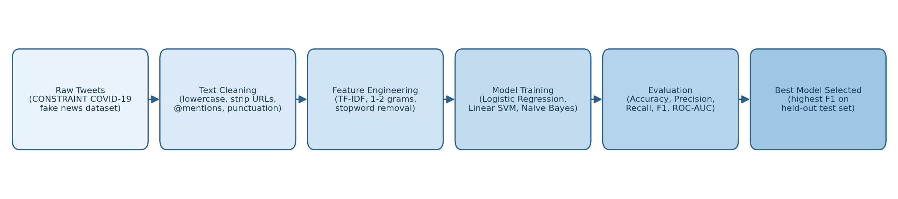
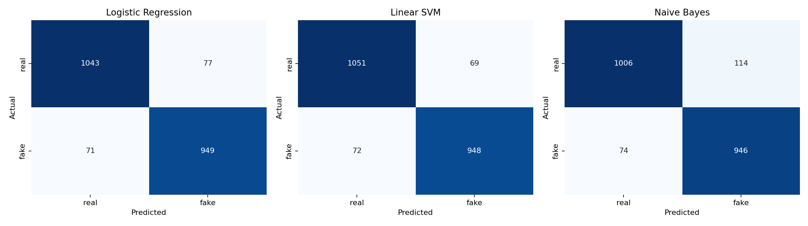
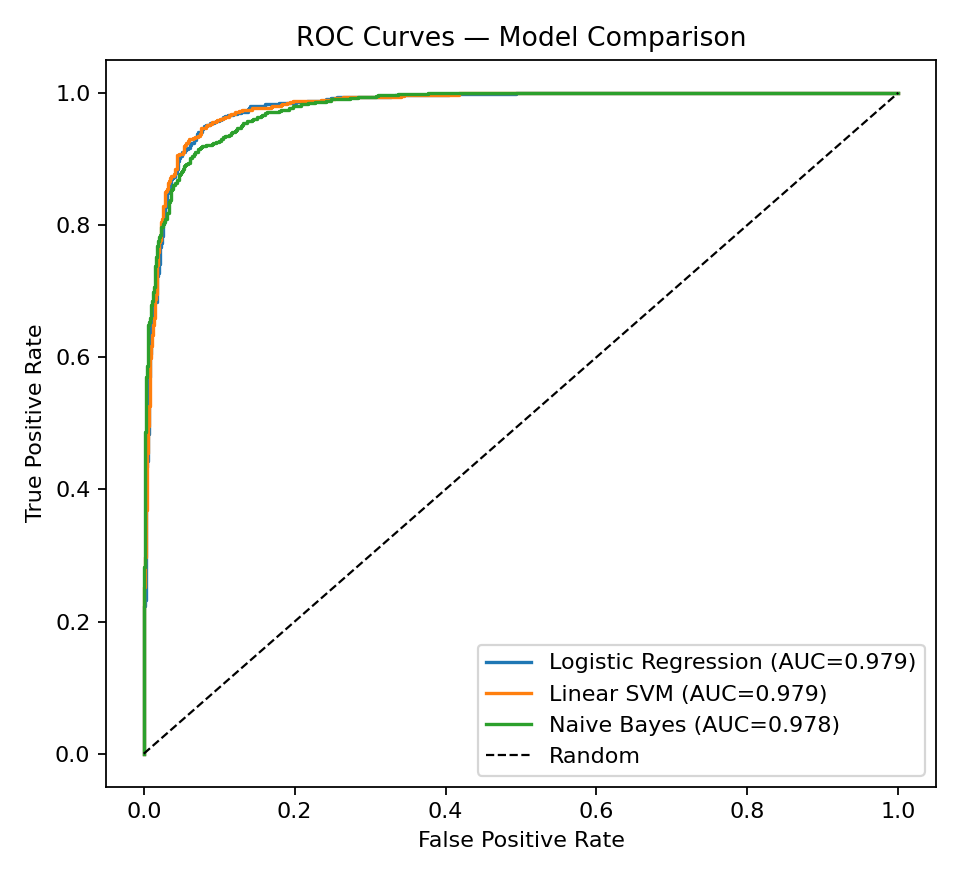

# Fake News Detection on Twitter

NLP/ML pipeline for classifying tweet-level COVID-19 content as **real** or **fake**, built for the Public Policy and Opinion Cell (PPOC), IIT Kanpur.

---

## 1. Project Overview

Misinformation on Twitter spreads faster than fact-checkers can respond to it. This project builds a lightweight, fully classical (no deep learning) text classification pipeline that flags a tweet as **fake** or **real** using TF-IDF features and three benchmark ML models — Logistic Regression, Linear SVM, and Naive Bayes.

The goal isn't to chase state-of-the-art transformer performance — it's to demonstrate a clean, reproducible, honestly-evaluated pipeline: proper train/test separation, standard NLP preprocessing, interpretable features, and rigorous comparative evaluation.

**Best model: Linear SVM — 93.4% accuracy, 0.931 F1-score, 0.979 ROC-AUC on held-out test data.**

---

## 2. Dataset Description

This project uses the **CONSTRAINT@AAAI2021 COVID-19 Fake News Detection (English)** dataset ([Patwa et al., 2021](https://arxiv.org/abs/2011.03327)), a manually annotated corpus of real-world social media posts (majority Twitter, some Facebook/Instagram) related to COVID-19.

| Split | Size | Real | Fake |
|---|---|---|---|
| Train | 6,420 | 3,360 | 3,060 |
| Validation | 2,140 | 1,120 | 1,020 |
| Test (held-out) | 2,140 | 1,120 | 1,020 |

- Train + validation sets (8,560 tweets combined) are used for fitting the vectorizer and models.
- The **test set is never touched during training** — all reported metrics come from this held-out split.
- Classes are close to balanced (~52%/48%), so accuracy is a meaningful metric alongside F1.
- Each row: `id`, `tweet` (raw text), `label` (`real` / `fake`).

---

## 3. Folder Structure

```
fake-news-detection-twitter/
├── data/
│   ├── train.csv                  # 6,420 labeled tweets
│   ├── val.csv                    # 2,140 labeled tweets
│   └── test.csv                   # 2,140 labeled tweets (held-out)
├── notebooks/
│   └── fake_news_pipeline.ipynb   # end-to-end notebook version
├── src/
│   ├── train_evaluate.py          # main pipeline script
│   └── make_pipeline_diagram.py   # generates the diagram below
├── outputs/
│   ├── results_table.csv
│   ├── sample_predictions.csv
│   ├── metadata.json
│   └── figures/
│       ├── pipeline_diagram.png
│       ├── confusion_matrices.png
│       └── roc_curves.png
├── requirements.txt
└── README.md
```

---

## 4. Pipeline Diagram



---

## 5. Preprocessing Steps

Applied to every tweet before vectorization:

1. **Lowercasing** — normalize case.
2. **URL removal** — strip `http(s)://...` and `www...` links (carry no lexical signal, just noise).
3. **Mention removal** — strip `@username` handles.
4. **Hashtag symbol stripping** — keep the hashtag word (`#COVID19` → `covid19`) since it's often informative, drop only the `#`.
5. **Non-alphabetic character removal** — strip digits, punctuation, emoji.
6. **Whitespace normalization** — collapse repeated spaces, trim.

No stemming/lemmatization was applied — TF-IDF with bigrams captured short tweet-length text well without it, and stemming was found to blur negation cues (e.g. "not effective" vs "effective") that matter for misinformation detection.

---

## 6. Feature Engineering

- **Vectorizer:** `TfidfVectorizer` (scikit-learn)
- **N-gram range:** (1, 2) — unigrams + bigrams, to capture short phrases like "no evidence" or "fake cure"
- **`min_df=3`** — drop terms appearing in fewer than 3 documents (noise reduction)
- **`max_df=0.9`** — drop terms in >90% of documents (near-stopwords)
- **`sublinear_tf=True`** — log-scaled term frequency, dampens the effect of repeated words in short text
- **English stopword removal**
- **Resulting vocabulary size:** 10,491 features

Feature engineering was deliberately kept classical/interpretable (TF-IDF) rather than dense embeddings, in line with the project's aim of a transparent, auditable baseline rather than a black-box model.

---

## 7. Models Compared

| Model | Configuration |
|---|---|
| Logistic Regression | `C=5`, `max_iter=2000` |
| Linear SVM | `LinearSVC(C=1)`, wrapped in `CalibratedClassifierCV` (Platt scaling) for probability outputs needed by ROC-AUC |
| Multinomial Naive Bayes | `alpha=0.3` |

All three trained on the identical TF-IDF feature matrix for a fair comparison.

---

## 8. Results Table

Evaluated on the **held-out test set** (2,140 tweets, never seen during training):

| Model | Accuracy | Precision | Recall | F1-score | ROC-AUC |
|---|---|---|---|---|---|
| Logistic Regression | 0.9308 | 0.9250 | 0.9304 | 0.9277 | 0.9791 |
| **Linear SVM** | **0.9341** | **0.9322** | 0.9294 | **0.9308** | **0.9794** |
| Naive Bayes | 0.9121 | 0.8925 | 0.9275 | 0.9096 | 0.9776 |

**Linear SVM is the highest-performing model**, edging out Logistic Regression on every metric except recall (near-tied), and clearly ahead of Naive Bayes on precision (0.932 vs. 0.893) — meaning it produces noticeably fewer false "fake" flags. Naive Bayes still recovers the most true fakes (highest raw recall trade-off), consistent with its known tendency to over-predict the minority-leaning class on TF-IDF features.

---

## 9. Confusion Matrices



All three models show a balanced error pattern — no systematic bias toward over- or under-flagging fake content. Naive Bayes has the most false positives (real tweets flagged as fake), consistent with its lower precision score above.

---

## 10. ROC Curves



All three models comfortably separate the classes (AUC > 0.97). Linear SVM and Logistic Regression curves are nearly indistinguishable at the top end; Naive Bayes trails slightly in the low false-positive-rate region, meaning it's less reliable at very high-confidence thresholds.

---

## 11. Sample Predictions

Predictions from the best model (Linear SVM) on random test-set tweets:

| Tweet (truncated) | True Label | Predicted | Confidence | Correct |
|---|---|---|---|---|
| "There is currently not enough evidence to suggest #COVID19 survivors become immune..." | real | real | 0.983 | ✅ |
| "Claim that Saint Corona has always been a patron saint against epidemics." | fake | fake | 0.999 | ✅ |
| "We also have to report a bug in our rolling average lines in some previous charts..." | real | real | 0.954 | ✅ |
| "South Dakota has yet to issue any directives to social distance or stay at home..." | real | real | 0.919 | ✅ |
| "@sandylocks is a celebrated legal scholar. She's been hosting Under the Blacklight..." | real | **fake** | 0.810 | ❌ |

Full set of 8 sampled predictions: [`outputs/sample_predictions.csv`](outputs/sample_predictions.csv). The one misclassification above is illustrative of the model's main failure mode: tweets that reference credentials/institutions in a promotional tone get pulled toward "fake" even when factually neutral — a known limitation of bag-of-words features, which lack real-world entity grounding.

---

## 12. How to Run the Project

```bash
# 1. Clone and enter the repo
git clone <your-repo-url>
cd fake-news-detection-twitter

# 2. Install dependencies
pip install -r requirements.txt

# 3. Run the pipeline
python src/train_evaluate.py

# Outputs (results table, figures, sample predictions) are written to outputs/
```

Or open `notebooks/fake_news_pipeline.ipynb` in Jupyter for a cell-by-cell walkthrough.

**Requirements:** Python 3.9+, scikit-learn ≥1.3, pandas, matplotlib, seaborn.

---

## 13. Future Improvements

- **Transformer baseline:** fine-tune a lightweight model (e.g. DistilBERT) to quantify the accuracy gap between classical TF-IDF and contextual embeddings on this dataset.
- **Social/metadata features:** incorporate user-level signals (account age, verification status, follower count) alongside text — known to boost fake-news detection performance beyond text-only models.
- **Live Twitter integration:** connect to the Twitter API for real-time scoring instead of a static CSV pipeline.
- **Error analysis by topic:** cluster misclassifications to identify whether errors concentrate around specific COVID-19 sub-topics (vaccines, case counts, policy claims).
- **Explainability:** add SHAP or LIME output so flagged predictions come with human-readable justification, useful for a policy/moderation context like PPOC's use case.
- **Threshold tuning:** currently uses the default 0.5 cutoff; a precision-recall tradeoff analysis could tune this for a moderation setting where false positives (censoring real content) are costlier than false negatives.

---

## Citation

Dataset: Patwa, P., et al. (2021). *Fighting an Infodemic: COVID-19 Fake News Dataset.* CONSTRAINT@AAAI2021. [arXiv:2011.03327](https://arxiv.org/abs/2011.03327)
